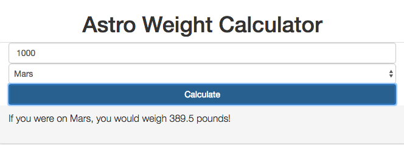

# Astro Weight Calculator
> Calculate what your weight (or any weight!) would be on another planet.

This was my first project at Origin Code Academy. This Astro Weight Calculator was created using HTML, CSS, Bootstrap, jQuery, and JavaScript.

## Approach

I took a mobile first approach with this project, and thus I wanted the design to be minimal with the focus on the functionality of this app.

## Installation

Download all associated files and load them up in your favorite text editor!

## Development setup

This app relies on jQuery and Javascript for its functionality and HTML, CSS, and Bootstrap for its design.

## Contact Information

Twitter: [@adriftinthesea](https://twitter.com/adriftinthesea)

Email: z@zamarise.com

GitHub:[https://github.com/zamarise](https://github.com/zamarise/)
